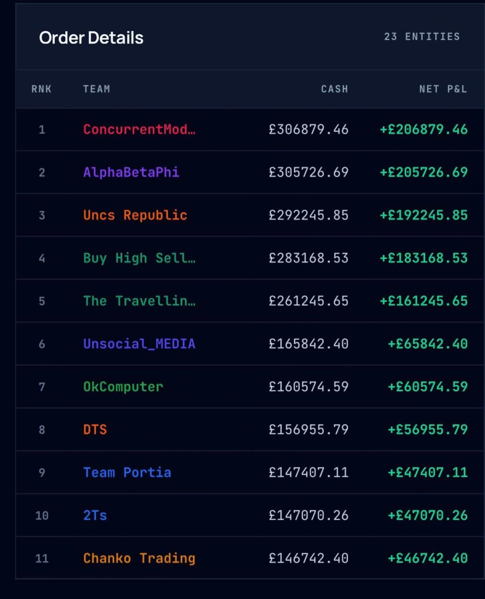
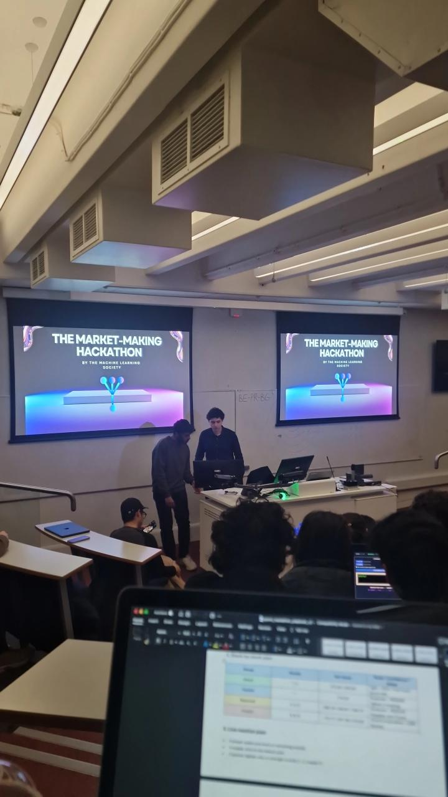

# QMML Market Making Hackathon

Machine learning-based market making strategy developed for the Queen Mary University of London Machine Learning Society Market Making Hackathon.

## Competition snapshot

---

## Overview

This project was built for a live simulated trading competition where teams submitted bid and ask quotes across 9 rounds, with the tightest spread becoming the market maker.

Our approach combined:
- fair value prediction for each stock
- uncertainty-aware quoting using sigma-based spreads
- leaderboard-aware tactical adjustments
- live decision logic for trading and quoting

We finished just shy of the top 10.

---

## Strategy

### Prediction layer
- NumPy ridge regression with exact leave-one-out cross-validation  
- sklearn models for larger datasets  
- simple ensembling of top models  

### Execution layer
- Confidence-based quote modes (tight, moderate, conservative, ultra)
- Stock-specific strategy (attack, flexible, protect)
- Leaderboard-aware decision making
- Forced trade handling when not market maker

---

## Repository structure

- `notebooks/` — final hackathon notebook  
- `docs/` — competition playbook  
- `assets/` — screenshots and visuals  
- `outputs/` — generated predictions and quotes  

---

## Key components

- Exact LOO ridge regression implementation
- Model selection and ensembling
- Uncertainty classification per stock
- Live decision dashboard logic
- Quote strategy based on confidence and position

---

## Results

- Maintained competitive pricing performance across all 9 rounds
- Strategy robustness driven by uncertainty-aware spread control
- Final ranking just outside the top 10 in a competitive field
- Identified position sizing as the main driver of missed P&L

---

## Improvements

- Better position sizing logic  
- Stronger execution under pressure  
- More structured performance attribution  
- Additional testing of quote aggressiveness  

---

## Contributors

- Husaam Ateeq  
- Hanad Ali  
- Blazej Olszta  
- Abdallah Ramadan
---

## Notes

Data and environment were provided as part of the QMUL Market Making Hackathon.
